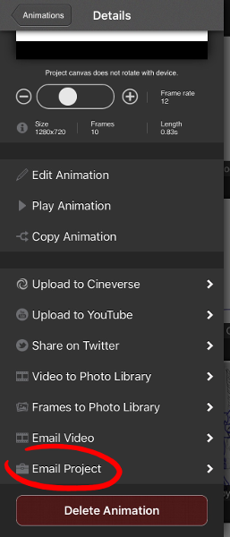
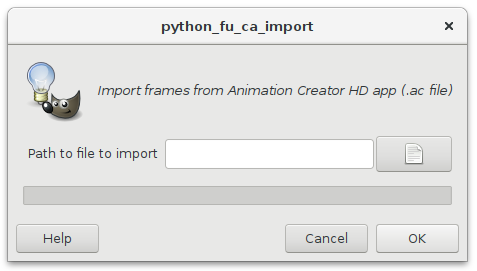

# GIMP Animation Creator import plug-in

[Animation Creator][1] is an iOS application for sketching animations. This is
a plug-in that allows you to losslessly import frames from an animation created
in Animation Creator into [GIMP][2], the free software drawing program.

Animation frames are imported in a format that is convenient for use with the
GIMP [Onion layers][3] and [Export layers][4] plug-ins.

[1]: https://itunes.apple.com/us/app/animation-creator-hd/id363201632
[2]: https://www.gimp.org/
[3]: https://github.com/avian2/gimp-plugin-onion-layers
[4]: https://github.com/khalim19/gimp-plugin-export-layers

## Installation

To install the plug-in, copy the `ac_import.py` file to `[your home folder]\.gimp-[GIMP version]\plug-ins`.

If you have GIMP 2.8 on Linux, running `make install` should also do the right
thing.

The plug-in was developed for GIMP 2.8.18 and Python 2.7. It might also work
with other versions - feedback regarding that is welcome.

## Usage

The import function provided by the plug-in can be found in the GIMP menu under
"Filters -> Animation -> Import from AC".

In the Animation Creator application, tap on an animation thumbnail and select
"Email Project". Send the resulting email with the ".ac" attachment to
yourself. Note that you will need to use an email account that can accept large
files (a 120 frame animation at 720p will be around 20 MB).

On a PC, save the ".ac" attachment to some folder on your disk. Now open GIMP
and create a new, empty image (size doesn't matter). Then select "Import from
AC" menu and select your ".ac" file. The button with the paper icon opens up
the file chooser dialog, so you don't have to type the path by hand.

After clicking "OK", your animation frames should be imported into GIMP. Each
frame is represented as a Layer Group in GIMP.

## Known limitations

Currently the plug-in should correctly handle multiple layers per frame, with
layer opacity and visibility settings imported into GIMP.

Blank frames are imported as empty layer groups. Backdrop image is not
imported.

Data not relevant to GIMP is ignored (e.g. audio, frame rate)

The plug-in was developed with files exported from Animation Creator version
1.14.3. Other versions might use a different file format and might not work
with this plug-in.

## License

GIMP Animation Creator import plug-in is Copyright (C) 2018 Tomaž Šolc tomaz.solc@tablix.org

This program is free software: you can redistribute it and/or modify it under
the terms of the GNU General Public License as published by the Free Software
Foundation, either version 3 of the License, or (at your option) any later
version.

This program is distributed in the hope that it will be useful, but WITHOUT ANY
WARRANTY; without even the implied warranty of MERCHANTABILITY or FITNESS FOR A
PARTICULAR PURPOSE.  See the GNU General Public License for more details.

You should have received a copy of the GNU General Public License along with
this program.  If not, see http://www.gnu.org/licenses/
